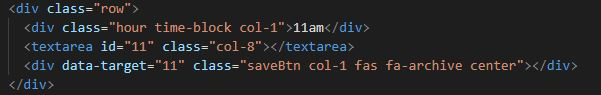

# Work Day Scheduler

A daily scheduler with a date field and clock that shows hours, minutes, and seconds. Designated areas for input of of daily tasks arranged by hour which highlight current activities separately from past and future events.

## Table of Contents

* [Tech Used](#tech_used)
* [Usage](#usage)
* [Features](#features)
* [Deployed_Link](#deployed_link)
* [Author](#author)
* [Credits](#credits)
* [License](#license)

----

## Tech Used

* [HTML](https://developer.mozilla.org/en-US/docs/Web/HTML)
* [Bootstrap](https://getbootstrap.com/)
* [Javascript](https://developer.mozilla.org/en-US/docs/Web/JavaScript)
* [JQuery](https://jquery.com/)
* [Moment.js](https://momentjs.com/)
* [Font_Awesome](https://fontawesome.com/)

## Usage
 
 This scheduler will allow text input into hourly columns and show the user current and upcoming events as well as past entries. The data utilizes local storage to recall data. A running calendar and clock display current date and time.

## Features

- Dynamic code to display current date and time.
  

- Area for text entry of calendar events designated my hour.
  

- Save button to save entries to local storage.
  

- Indexed hours compared to time variable to update past, present, and future time slots.
  

- Text areas are linked to dynamic clock to display entries as past, present, and future. 
  

## Deployed Link

* [See Live Site](https://ajhuff7.github.io/work-day-scheduler/)

---

## Author

**AJ Huff** 

- [Portfolio Site](#)
- [Github](https://github.com/ajhuff7)
- [LinkedIn](https://www.linkedin.com/in/aj-huff-7696b14b/)

## Credits

**Huge thank you to team members, coaches and staff!**

## License

 